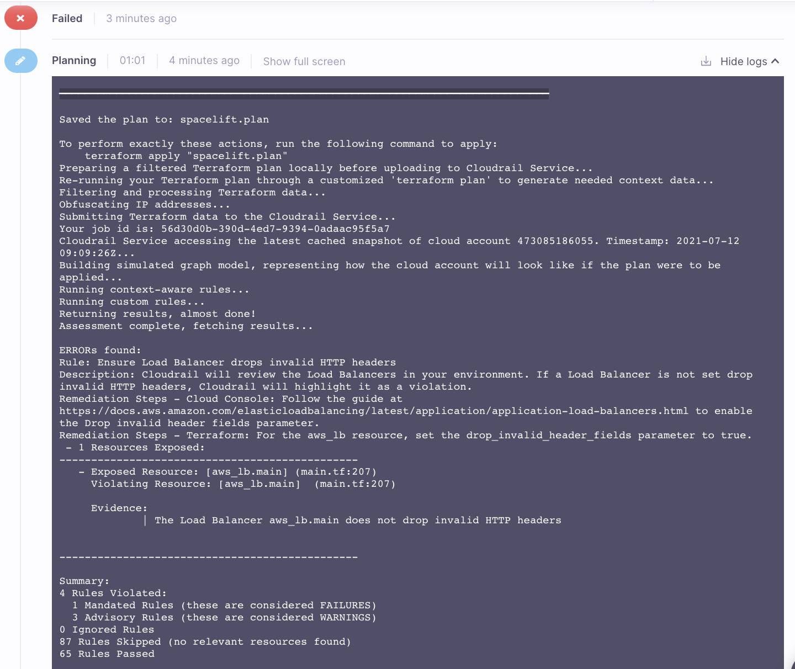

# cloudrail-spacelift
In order to use Cloudrail within Spacelift, a custom docker image is required, as well as a small change to the stack settings. This repository provides instructions and an example for how to use Cloudrail within Spacelift.


## Creating the docker image
These are just sample instructions. We do not recommend using our sample [Dockerfile](docker/Dockerfile) as-is. Rather, we recommend adopting what is described below for your usage of Spacelift.

In the [Dockerfile](docker/Dockerfile), you'll note a couple of things:
1. We add pip and Python, as these are not available by default.
2. We install the Cloudrail CLI tool via pip.

Pushing this docker image to a public AWS ECR is simple. Create the repository (using Terraform of course!) and then follow instructions similar to these:
```
aws ecr-public get-login-password --region us-east-1 | docker login --username AWS --password-stdin public.ecr.aws/f8i6n0s5
docker build -t cloudrail-spacelift .
docker tag cloudrail-spacelift:latest public.ecr.aws/f8i6n0s5/cloudrail-spacelift:latest
docker push public.ecr.aws/f8i6n0s5/cloudrail-spacelift:latest
```

This will make the container image available for access from Spacelift. Note that public workers require public container images, per [Spacelift's documentation](https://docs.spacelift.io/integrations/docker).

## Using the docker image
1. Within the Spacelift web interface, look for your stack. Click on it.
2. At the top look for Settings.
3. Look for the BEHAVIOR tab, click on it, then EDIT, and then EDIT BEHAVIOR at the bottom of the screen.
4. Replace the "Runner image" with the path to the container image you created above (in the above example, it would be public.ecr.aws/f8i6n0s5/cloudrail-spacelift:latest).
5. In the "After plan scripts" add just one command:
```
cloudrail run -p spacelift.plan --origin ci --build-link "https://${TF_VAR_spacelift_account_name}.app.spacelift.io/stack/${TF_VAR_spacelift_stack_id}/run/${TF_VAR_spacelift_run_id}" --execution-source-identifier "${TF_VAR_spacelift_commit_branch} - ${TF_VAR_spacelift_commit_sha}" --auto-approve
```
6. Go back to the stack itself, and look for Environment at the top (it's near the Settings tab you clicked on earlier).
7. Add an environment variable called CLOUDRAIL_API_KEY, with your Cloudrail API key (available from the Cloudrail web interface). Make sure to mark it as SECRET.

## Testing it all
Now, go to your stack and trigger it. If everything was configured correctly, you'll see the Planning phase taking slightly longer than before (in the area of 20-30 seconds longer) and the following output:
```
... (TF plan info)...
Saved the plan to: spacelift.plan

To perform exactly these actions, run the following command to apply:
    terraform apply "spacelift.plan"
Preparing a filtered Terraform plan locally before uploading to Cloudrail Service...
Preparing a filtered Terraform plan locally before uploading to Cloudrail Service...
Re-running your Terraform plan through a customized 'terraform plan' to generate needed context data...
Filtering and processing Terraform data...
Filtering and processing Terraform data...
Obfuscating IP addresses...
Submitting Terraform data to the Cloudrail Service...
Submitting Terraform data to the Cloudrail Service...
Your job id is: 275097b8-6c3b-4bfc-a596-55b8af068da1
Cloudrail Service accessing the latest cached snapshot of cloud account 473085186055. Timestamp: 2021-07-12 09:09:26Z...
Building simulated graph model, representing how the cloud account will look like if the plan were to be applied...
Running context-aware rules...
Running custom rules...
Building simulated graph model, representing how the cloud account will look like if the plan were to be applied...
Running context-aware rules...
Running custom rules...
Returning results, almost done!
Assessment complete, fetching results...


Summary:
4 Rules Violated:
  0 Mandated Rules (these are considered FAILURES)
  4 Advisory Rules (these are considered WARNINGS)
0 Ignored Rules
87 Rules Skipped (no relevant resources found)
65 Rules Passed

NOTE: WARNINGs are not listed by default. Please use the "-v" option to list them.

To view this assessment in the Cloudrail Web UI, go to https://web.cloudrail.app/environments/assessments/275097b8-1234-4bfc-a596-55b8af068da1
```

If your stack violates any Mandated Rules (per the policy you configured in Cloudrail), then the cloudrail call will return an exit code of 1. This will cause Spacelift to stop the stack triggering and show an error in the Planning phase. The log of the Planning phase will include the violation and how to fix it:

